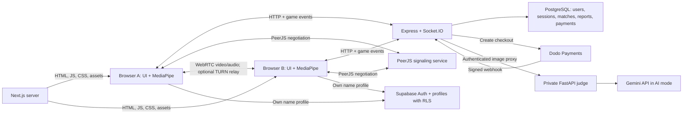

# Emoggle architecture

Reviewed on **2026-10-03** against the current working tree, including local changes. This describes the implemented system. [CODEBASE_GUIDE.md](CODEBASE_GUIDE.md) provides the module walkthrough, review findings, and verification results.

## System overview

Emoggle is a browser webcam game. Next.js renders the site and game screens; an Express/Socket.IO service pairs players and coordinates rounds; MediaPipe calculates facial landmarks in each browser. Live video and audio use a separate PeerJS/WebRTC connection.

| Mode | Frontend view | Behavior |
| --- | --- | --- |
| Live emoji duel | `DuelArena.tsx` | Pair players, optionally show FaceSync resemblance, count down for three seconds, then compare ten seconds of expression scores. |
| Solo Emoji Scan | `SoloFaceJudge.tsx` | Run a ten-second local expression round and save browser history. No matchmaking socket is needed. |
| Celebrity mimic | `CelebrityDuelArena.tsx` | Pair players around one reference image and compare their best valid expression scores. The current target is the IShowSpeed Squint pilot. |
| FaceSync | `FaceSyncArena.tsx` | Show both players the same resemblance result and keep the session open for chat or another stranger. No emoji scan follows. |

A fashion-photo judge also exists, but `HomeExperience.tsx` does not expose `UploadJudge.tsx`. The Remotion marketing video is a separate project.

## Service boundaries



The Express service handles game signaling but does **not** host PeerJS. The hooks construct `new Peer(...)` without a custom PeerJS host, using public STUN servers and an optional configured TURN server. Socket.IO carries control, chat, scores, and FaceSync vectors rather than video.

Supabase name profiles and signaling identities are separate. They may use the same database provider, but the code does not map Supabase `auth.users` IDs to signaling `users.id` values.

## Repository and stack

```text
Emoggle-main/
  index.js                       Delegates to signaling-server/index.js
  frontend/                      Next.js App Router application
    app/components/              Landing, arenas, video, chat, results
    app/context/                 Theme, session, name, country, MediaPipe
    app/hooks/                   Camera, matchmaking, scoring, timing
    app/lib/                     Storage, profiles, algorithms, site facts
    app/ui/                      UI primitives and SVG icons
    components/ui/               Reusable text animations
    scripts/                     Unit-style and browser verification
    public/                      MediaPipe WASM, artwork, theme boot script
  signaling-server/              Express, Socket.IO, raw PostgreSQL queries
    middleware/                  Session authentication
    routes/                      Celebrity catalogue
    test/                        Unit and multiplayer tests
    prisma/                      Historical schema/migration files
  ai-judge/                      FastAPI photo judge and tests
  supabase/migrations/           Display-name table and RLS
  marketing-video/               Independent Remotion video and audio
  graphify-out/                  Generated code graphs and caches
  .github/                      Security CI and Dependabot
```

These are **manifest versions**, not claims about the latest releases:

| Area | Main dependencies |
| --- | --- |
| Frontend | Next.js **16.3.5**, React **19.2.4**, TypeScript `^5`, Tailwind `^4`, Framer Motion, MediaPipe Tasks Vision, PeerJS, Socket.IO client, Supabase JS, html-to-image. |
| Signaling | Node **>=18**, Express 4, Socket.IO 4, `pg`, dotenv, cookie-parser, express-rate-limit, Dodo Payments. CI uses Node 22. |
| Judge | FastAPI 0.141.1, Uvicorn 0.52.1, Pydantic 2.13.4, google-generativeai 0.8.6, Pillow 12.3.0. CI uses Python 3.12. |
| Video | Remotion **4.0.529**, React **19.1.0**, TypeScript **5.8.3**; Python/NumPy for sound generation. |

Prisma is not the active database client. `db.js` uses parameterized SQL through `pg`. Lenis remains a dependency, but the current `SmoothScroll` uses native scrolling with a no-op controller.

## Frontend composition

`app/layout.tsx` is the server layout: metadata, fonts, request nonce, theme boot script, `SmoothScroll`, and `ThemeProvider`. `app/template.tsx` is a simple server route wrapper. `app/page.tsx` renders landing content, JSON-LD, and the doodle backdrop. Its client entry point is `HomeExperience.tsx`:

```text
UserProfileProvider
  PlayerNameProvider
    CountryProvider
      MotionConfig
        HomeContent
          home -> ModeSelect
          game -> MediaPipeFaceProvider -> selected arena
```

Games are client-state views on `/`, not separate routes. Arenas, mode picker, and name gate use dynamic imports. Entering a game resets scroll position; returning home restores the previous position.

Visitors can browse the homepage and informational routes without entering a name. "Play now" opens the mode picker; selecting a game opens name entry only if no saved name exists. A valid saved name starts that selected game. Cancelling name entry abandons the game choice and returns to browsing. Support remains available independently of name entry.

MediaPipe initializes for game views through a shared promise. It creates a GPU FaceLandmarker in video mode with one face and blendshapes. WASM is bundled under `/mediapipe/wasm`; the model comes from Google's model storage using a `latest` URL.

`globals.css` provides Tailwind, light/dark tokens, responsive styles, and deferred rendering of lower homepage sections. `useCoveredView` uses a reference-counted `data-covered` attribute to hide the page backdrop while an arena or picker covers it. Motion components honor reduced-motion preferences.

## Identity and state

### Signaling session

1. `UserProfileProvider` gets a device UUID from localStorage.
2. When `NEXT_PUBLIC_SIGNALING_SERVER_URL` is set, it calls `POST /api/session`, passing the tab's existing bearer token when available.
3. The server returns `{ id, elo, isVIP, deviceId, socketToken }`.
4. The token lives in sessionStorage under `emoggle:tab-session-token:v2`. BroadcastChannel coordination checks whether a duplicated tab copied another active tab's token.
5. `useMatchmaking` sends the token in Socket.IO `auth.token`. The server derives user identity from it and permits one live socket per signaling user.

Database tokens are random 32-byte values encoded as 64 hex characters; only SHA-256 hashes are persisted. Database sessions expire after seven days and are swept hourly. HTTP verification can also use the `emoggle_session` cookie, but bootstrap resumes only from an explicit bearer so separate tabs obtain separate users.

The database-less fallback stores raw tokens and users in process-local Maps. It currently lacks the database path's expiry/revocation behavior. Local multiplayer can run with this fallback, while production celebrity and FaceSync match creation reject persistence failure. Fallback `/ready` returns 503.

### Name profile and other local data

Saving a name validates it, updates localStorage immediately, marks it pending, and lazily writes through the Supabase profile service when configured. That service reuses an existing session or signs in anonymously. `public.profiles` has own-row select/insert/update RLS and a database timestamp trigger.

**Current behavior:** `PlayerNameProvider` hydrates from localStorage only. It does not read the remote profile or automatically replay pending writes at startup, despite older comments saying otherwise. `retrySync()` exists but has no current UI consumer. The Supabase client accepts publishable or legacy anon keys, whereas the provider's configuration check requires the publishable-key variable. OAuth helpers exist but are not called by the current UI.

`storage.ts` caps duel and solo history at 50 entries each, migrates older keys, deduplicates duel entries by match ID, and calculates aggregate stats. `/history` reads this local history rather than a server API. Country data has a 24-hour cache; the current provider reads it on mount and only performs network detection after `refresh()`, which has no current UI caller. Theme uses `emoggle:theme` and defaults to light.

## Matchmaking and rounds

All multiplayer arenas use **`useMatchmaking.ts`**, including celebrity mode. `useCelebrityMatchmaking.ts` remains an unused alternate implementation.

### Pairing

PeerJS and Socket.IO initialize in parallel after a token is ready. Once both the peer ID and socket are available, the browser emits:

```json
{
  "peerId": "browser-peer-id",
  "name": "Player",
  "country": null,
  "countryCode": null,
  "gameMode": "emoji",
  "ticket": null
}
```

The server validates fields, refreshes the authenticated user, and records socket metadata. Queue selection prefers a connected same-mode player who is available and not excluded by a recent skip. **The queue does not filter by ELO, gender, or country.**

If only a different-mode player is waiting, the new arrival receives `switch_mode` and a transfer ticket. `HomeExperience` changes arenas; the replacement socket joins with the same session and ticket. Tickets expire after ten seconds. Both players must have the same mode before pairing.

### Expression rounds

```mermaid
sequenceDiagram
    participant A as Browser A
    participant S as Signaling server
    participant B as Browser B
    A->>S: join_queue
    B->>S: join_queue
    S-->>A: match_started with peer role and schedule
    S-->>B: match_started with peer role and schedule
    A->>B: PeerJS/WebRTC call and camera stream
    B->>A: Answer with camera stream
    Note over A,B: Emoji has a FaceSync lead-in; celebrity skips it
    S-->>A: countdown_tick then go
    S-->>B: countdown_tick then go
    A->>S: live_score during ten-second scan
    B->>S: live_score during ten-second scan
    A->>S: submit_score
    B->>S: submit_score
    S->>S: Finalize once and persist when available
    S-->>A: Player-relative match_result
    S-->>B: Player-relative match_result
    S->>S: Release room, timers, and match indexes
```

The server publishes absolute timestamps and controls a three-second countdown. `ServerClock` estimates offset from low-RTT `time_sync` acknowledgements. The first zero-count/go packet anchors a full ten-second local scan. Predictions include 1.5 seconds of slack until go arrives. `useRoundClock` evaluates deadlines every 100 ms and on visibility changes, rather than counting interval ticks.

Explicit submissions are accepted from two seconds before the server scan deadline until four seconds afterward. Live scores are accepted during the scan and grace window, capped at 150 samples per player. At the deadline plus grace, missing scores resolve from received samples or zero. `resultSent` is set before awaiting persistence so submissions and timeout cannot finalize twice.

The canonical `match_result` supplies each player's final score, opponent score, and winner. Completed server match state is released while the frontend keeps its visible result. Skips, stops, and disconnects clear room/timers/vectors/indexes and requeue eligible remaining players. A recent skip excludes the immediate former partner. Missing remote video warns rather than cancelling an otherwise active match.

### FaceSync

FaceSync runs before emoji rounds and as a standalone mode, but not before celebrity rounds.

- The browser derives 20 geometry ratios in a head-relative 3D coordinate system, correcting for video aspect ratio and rejecting invalid, small, out-of-frame, turned, or tilted faces.
- It collects at least 14 valid samples, up to 40, then uses per-feature medians and a dispersion threshold of 0.05.
- It sends one vector or `{ unavailable: true }`. The client timeout is 5.5 seconds; the server ceiling is seven seconds.
- The server validates 20 finite components within `[-4, 4]` and broadcasts an identical deterministic score/category/variant to both players.
- Vectors are discarded immediately after calculation and during match cleanup; no vector is written to PostgreSQL.
- Emoji rounds pause for a 3.8-second reveal before their countdown, or start immediately after an unavailable comparison. Standalone FaceSync stays on its result/missed view until players leave or request another stranger.

Standalone FaceSync does not finalize expression scores or update ELO. Its persisted match row stays active until the session ends; resemblance results are not persisted.

## Scoring

| Mode | Algorithm and final aggregation |
| --- | --- |
| Emoji | Landmark geometry for common smile, astonished, wink, angry, and sad prompts; blendshapes for other prompts. Scores are bounded to 0..10. The browser samples valid values every 100 ms and submits the mean. The server requires five live samples and averages their mean equally with the submitted mean, rounded to one decimal. |
| Solo | Same scorer and sampler; final valid-sample mean, or zero, saved locally. |
| Celebrity | Nine normalized expression metrics, each scored as `clamp(1 - 4 * difference^2, 0, 1)`, combined by weighted mean and scaled to 0..10. Target resolution prefers curated profiles, then landmarks, then category/difficulty defaults. The arena submits its best valid frame, rounded to one decimal. The server accepts the bounded peak; missing submissions fall back to live-sample mean. |
| FaceSync | Weighted distance divided by feature tolerances, mapped through `100 * exp(-(distance / 1.90)^1.405)`. Display is an integer clamped to **3..99**, with eight reaction categories. This is an entertainment heuristic, not a calibrated identity probability. |

Scores are generated by clients. Window checks, clamping, and sample-count validation do not make them cheat-proof. ELO changes are disabled unless `ENABLE_RANKED_ELO=true`; celebrity also requires `CELEBRITY_AFFECTS_ELO=true`. Enabled ELO uses K=32 and default 1000; it does not affect queue selection.

Results reuse one reaction string for screen and share card. A body portal renders an off-screen 1080 x 1350 card; html-to-image creates a PNG after fonts/layout settle. Sharing uses native file sharing where supported, otherwise download. Result analytics currently log sanitized events to the browser console.

## Persistence

The active signaling schema is `signaling-server/db.js::initSchema()`, called at startup. It uses a pool of up to 20 connections with connection/query/statement timeouts. Match creation and score/payment updates use transactions where appropriate.

| Table | Role |
| --- | --- |
| `users` | Signaling UUID, current socket, ELO, VIP flag, device ID, and historical account columns. |
| `sessions` | Hashed database tokens, user foreign key, creation/expiry timestamps. |
| `matches` | Players, emoji, scores, winner, status, timestamps, game mode, optional celebrity ID/name. |
| `celebrity_faces` | Image metadata, difficulty, optional landmark/profile JSON, usage count. |
| `moderation_reports` | Match, reporter/reported user, reason; unique per match/reporter. This handler stores no camera evidence. |
| `dodo_webhook_events` | Provider event IDs for replay deduplication. |
| `support_payments` | Payment/device IDs, requested/charged amounts, currency, refund flag, paid time. |
| `public.profiles` | Separate Supabase Auth-owned names, timestamps, own-row RLS. |

`schema.sql` is an older baseline missing some current columns/tables. Prisma's historical schema differs from current UUID/ELO conventions. Apply the Supabase profile migration separately: signaling startup does not create it or its policies.

The celebrity seed inserts records but does not supply all their image assets. Only the pilot image is bundled, and active matchmaking explicitly filters to that pilot name. More seeded rows alone do not expand current target selection.

## HTTP and socket contracts

All Express `/api` routes share rate limiting. Session mutations, checkout, and judge also check trusted browser origins.

| Method | Path | Authentication | Behavior |
| --- | --- | --- | --- |
| POST | `/api/session` | Optional bearer for resume | Create/resume anonymous signaling session. |
| DELETE | `/api/session` | Session | Delete database token and clear cookie. |
| GET | `/api/users/me` | Session | ID, ELO, VIP flag. |
| POST | `/api/billing/checkout` | Session | Validate USD amount and create Dodo checkout. |
| POST | `/api/webhooks/dodo` | Signed webhook | Record payment/full-refund events. |
| POST | `/api/judge` | Session | Proxy bounded image to private judge. |
| GET | `/api/geo` | Public | Edge country only when headers are explicitly trusted. |
| GET | `/api/celebrity/random` | Session | Catalogue read with optional difficulty/category. |
| GET | `/api/celebrity/list` | Session | Validated pagination/category filter. |
| POST | `/api/celebrity/landmarks` | Session | Fetch stored landmarks by faceId; no landmark computation. |
| GET | `/api/celebrity/:id` | Session | Read catalogue item. |
| GET | `/`, `/health` | Public | Process liveness. |
| GET | `/ready` | Public | Database availability flag; 503 in fallback mode. |
| GET | `/online` | Public | Connected Socket.IO transport count, not homepage visitors. |

No current auth login/register, onboarding, leaderboard, or server history routes exist. Next.js `llms.txt` and `llms-full.txt` handlers serve product text.

| Direction | Events | Purpose |
| --- | --- | --- |
| Client -> server | `time_sync` | Clock acknowledgement handshake. |
| Client -> server | `join_queue`, `skip_user`, `stop_matching` | Queue, transfer, skip, stop. |
| Client -> server | `face_sync_sample` | One geometry/unavailable report. |
| Client -> server | `live_score`, `submit_score` | Scores; v2 packets include attempt ID/generation. |
| Client -> server | `chat_message`, `typing`, `report_player` | Ephemeral chat/typing and persisted report. |
| Server -> client | `waiting`, `switch_mode`, `match_started` | Queue, transfer, paired peer metadata and schedule. |
| Server -> client | `countdown_tick`, `emoji_locked`, `emoji_changed` | Timing and target state. |
| Server -> client | `face_sync_result`, `face_sync_skipped` | Shared resemblance or bypass. |
| Server -> client | `partner_live_score`, `partner_score`, `scores_ready`, `match_result` | Live display and canonical result. |
| Server -> client | `chat_message`, `rival_typing` | Partner messages/typing. |
| Server -> client | `match_skipped`, `opponent_left` | Reset client match and await requeue. |
| Server -> client | `user_id`, `usage_update`, `server_error`, `score_rejected` | Identity/entitlements, fatal error, nonfatal score rejection. |

Client listeners for `match_found`, `match_ended`, and `partner_country` are compatibility code, not current server broadcasts.

## Protocol v2 rounds, private series and support prompts

The October 3 implementation adds `signaling-server/roundEngine.js`, `privateDuels.js`, `duelStore.js` and `duel-schema.sql`. See [IMPLEMENTATION_REPORT.md](IMPLEMENTATION_REPORT.md) for verified behavior, configuration and deployment prerequisites.

Compatible emoji/celebrity clients advertise `protocolVersion: 2`. The shared engine reserves a pair separately from its scoring attempt, waits for both assigned media connections, runs the existing emoji FaceSync lead-in, waits for both target acknowledgements, then previews an emoji for one second (celebrity retains three seconds). Scan time is ten seconds. Legacy clients and standalone FaceSync retain their established lifecycle. `change_emoji` cannot bypass consent.

`round_state` carries attempt ID, monotonic schedule generation, phase and timestamps. `round_started` replaces an attempt while retaining the pair, PeerJS connection and chat. `live_score`/`submit_score` and incoming scores/results are checked against the current attempt/generation. `emoji_skip_request` creates an eight-second paused proposal; `emoji_skip_respond` requires two distinct explicit votes. A decline/timeout preserves samples and remaining time; agreement creates a new attempt with a different emoji. There are three proposals per logical round and a five-second resolution cooldown.

`/1v1` is rendered by `PrivateDuelExperience`. One responsive screen combines a purple 1/3/5 round slider (default 3) and radio cards for Emoji Duel, Celebrity Face and Face Sync. The name gate follows explicit invitation creation. Guest invitation previews are read-only until explicit join. New rooms use twelve cryptographically random base-32 characters (60 bits), displayed in three groups of four. Only SHA-256 digests are stored. Guests enter a code on the same page, preview the rules, then explicitly join. Case, spaces and hyphens are normalized; authenticated requests and existing per-IP/per-user rate limits bound guesses. Legacy 43-character fragment invitations remain accepted during transition and are removed from the URL after capture. Secrets expire in fifteen minutes and reserve one guest transactionally. Regeneration invalidates the previous invitation. Only authenticated participants receive snapshots or perform series actions. Private players never enter public queues.

Private Face Sync reuses the pair engine and existing `FaceSyncArena` for repeated resemblance comparisons. Each round requires both players' readiness and fresh attempt/generation-bound face samples. It ends at the shared resemblance result (or unavailable-face outcome), without an emoji/countdown/scoring phase, ELO, competitive points or automatic scored-round support. The ledger records completion; the arena keeps the same cameras/chat between comparisons. The additive schema migration extends the existing game-mode constraint to accept `facesync`.

Authenticated APIs: `POST /api/duels`, `POST /api/duels/invite-preview`, `POST /api/duels/join`, `GET /api/duels/:id`, `POST /api/duels/:id/invite`, `POST /api/duels/:id/cancel`. Public capabilities are at `GET /api/capabilities`. Socket events add `private_join`, `series_ready`, `series_sync`, `series_leave`, `series_state`, `round_media_ready`, `round_target_ready`, `round_retry`, and nonfatal `operation_error`/`round_error`.

A private series plays every selected round against the same friend, waits for both players' readiness initially and between rounds, awards one point per win and half each for a tie, and permits a final draw. The unique `(series_id, round_number)` ledger and transaction update points once. Private rounds do not update ELO. Interrupted unfinished attempts restart after reconnect and renewed readiness; reconnect grace is thirty seconds, lobby/intermission inactivity is 120 seconds and series lifetime is ninety minutes. The signaling process remains one coordinator. On restart it aborts unfinished durable series; old private invitations cannot silently join a public game.

`ExperienceProviders` shares name, country, signaling profile and `SupportPromptProvider`. The provider now renders the single SupportModal outside ModeSelect. Canonical multiplayer results and guarded solo results feed a bounded, deduplicated completion policy: first prompt after one completed round, then after the first completed round following a twelve-hour cooldown. Prompt eligibility is created by a new completion, never by loading historical storage. Display waits for visible results and no conflicting modal. Private readiness disables automatic display after the player's Ready click. Browser locks/storage/BroadcastChannel coordinate tabs; without those APIs coordination is best effort per tab. Manual support remains available.

Private checkout shows an explicit HTTPS Dodo-hosted link in a new tab with `noopener noreferrer`; it preserves the game tab. Returned checkout destinations are restricted to the live/test checkout hosts. Existing signed webhooks remain the payment authority. Calls disclose camera streams only to the assigned peer with the server-issued pair/media nonce; old call callbacks cannot replace a new opponent's stream.

The additive private SQL tables enable RLS and revoke browser/PUBLIC grants. Production PostgreSQL requires verified TLS, with an optional configured CA. Private creation fails closed without persistence in production; memory storage is local-development only. The database constraint/grant suite is included but requires a disposable initialized database; it could not be run against the configured invalid credentials.

## Optional support and judge

**Support:** The shared provider controls manual and completion-triggered prompts (details above). `SupportModal` submits at least $1.00 USD. The server verifies a one-time USD pay-what-you-want Dodo product with a $1.00 minimum, then returns a checkout URL. Signed success webhooks persist payment data; full-refund success marks it refunded. Event/payment IDs prevent duplicate writes. Return query strings are not proof of payment. Support does not grant VIP or gate games.

**Judge:** `UploadJudge` would post to Express `/api/judge`. Express adds the private `X-AI-Judge-Key` header and calls FastAPI `/judge`. FastAPI authenticates, rate-limits, validates base64/signature/Pillow data, and bounds bytes/pixels. Random mode immediately returns demo feedback. AI mode uses Gemini with concurrency/time limits; failures return errors rather than silently switching to random output. No upload persistence is implemented.

## Configuration and local operation

Combine the relevant fields from `frontend/env.example` (services) and `frontend/.env.example` (site verification) into `frontend/.env.local`. Actual environment secrets were not included in this review.

| Component | Variables |
| --- | --- |
| Frontend sessions | `NEXT_PUBLIC_SIGNALING_SERVER_URL`; defaults to `http://localhost:3001` locally. Session creation, matchmaking, and API calls share `app/lib/signaling.ts`. |
| Frontend names | `NEXT_PUBLIC_SUPABASE_URL`, `NEXT_PUBLIC_SUPABASE_PUBLISHABLE_KEY`; client also accepts `NEXT_PUBLIC_SUPABASE_ANON_KEY`, subject to the provider caveat. Enable anonymous Auth and apply the profile migration. |
| Optional relay | `NEXT_PUBLIC_TURN_URL`, `NEXT_PUBLIC_TURN_USERNAME`, `NEXT_PUBLIC_TURN_CREDENTIAL`; these are browser-visible. |
| Signaling database | `DATABASE_URL` or `DB_HOST`, `DB_PORT`, `DB_NAME`, `DB_USER`, `DB_PASSWORD`. Complete discrete fields rebuild the URL. `DB_CA_CERT` is also read. |
| Signaling operation | `PORT` (3001), `NODE_ENV`, `FRONTEND_URL`, `TRUST_PROXY_HOPS`, `MAX_CONNECTIONS_PER_IP`, `TRUST_GEO_HEADERS`. |
| Optional ranking | `ENABLE_RANKED_ELO`, `CELEBRITY_AFFECTS_ELO`; explicitly true to enable. |
| Private judge proxy | Server-only `AI_JUDGE_URL`, `AI_JUDGE_SHARED_SECRET`; matching secret in FastAPI. |
| Support | Server-only `DODO_PAYMENTS_API_KEY`, `DODO_PAYMENTS_WEBHOOK_KEY`, `DODO_PAYMENTS_PRODUCT_ID`, `DODO_PAYMENTS_ENVIRONMENT`, `DODO_PAYMENTS_RETURN_URL`. |
| FastAPI | `ENVIRONMENT`, `PORT` (8000), `JUDGE_MODE`, `GEMINI_API_KEY`, `GEMINI_MODEL`, `MAX_CONCURRENT_JUDGES`, `ALLOWED_ORIGINS`, `FORWARDED_ALLOW_IPS`, `DEBUG_RELOAD`. |

Legacy example fields `NEXT_PUBLIC_AI_JUDGE_URL`, `NEXT_PUBLIC_GOOGLE_CLIENT_ID`, and `NEXT_PUBLIC_SITE_URL` are not current inputs to the judge proxy, OAuth helper, or canonical site URL. `siteConfig.url` is fixed to `https://emoggle.com`.

Run packages in separate terminals; there is no root npm workspace manifest:

```powershell
# In signaling-server/
npm.cmd ci
npm.cmd run dev

# In frontend/
npm.cmd ci
npm.cmd run dev

# Optional, in ai-judge/
python.exe -m pip install -r requirements.txt
python.exe main.py
```

`start-backend.ps1` starts signaling. `start-frontend.ps1` starts port 3000 and redirects output to `frontend/frontend.log`. Database-less local matches do not exercise persistent reports, payments, or catalogue HTTP APIs.

## Hosting and operational limits

Frontend settings/domain aliases indicate Vercel-oriented hosting; this source review does not establish live deployment health. Signaling requires a long-running Socket.IO process; FastAPI is optional. Next.js uses `.next-build`, security headers, and redirects www/Vercel aliases to the apex domain.

`proxy.ts` generates CSP nonces and allowlists configured signaling/Supabase origins plus supporting services. Some RevenueCat/Paddle CSP entries are historical; no RevenueCat context or purchase route is currently wired in. Express enforces CORS, sessions, selected mutation origins, body limits, connection-attempt limits, per-IP sockets, per-event limits, and a total packet budget. Chat is bounded and scrubbed within match rooms; moderation identity comes from server match state.

Queue, matches, transfers, live samples, vectors, and rate-limit maps belong to one Node process. No Redis adapter or shared match coordinator is configured. Replicas would split matchmaking pools without further coordination; restarting discards active rounds and memory sessions. PostgreSQL rows do not rebuild live timers or peer connections.

Production database TLS requires `rejectUnauthorized: true`, optionally with `DB_CA_CERT`; URL SSL parameters cannot override verification. A constructor-level regression test covers this configuration, while an actual database handshake remains a deployment prerequisite. TURN credentials are static public build settings. `/ready` checks a flag, not a fresh database query. These operational limits are recorded in the guide.

CI audits/builds frontend, audits/tests signaling, and checks Python dependencies/image validation. It does not currently run frontend lint or cover marketing-video. See [verification performed](CODEBASE_GUIDE.md#verification-performed) for checks run during this review.
